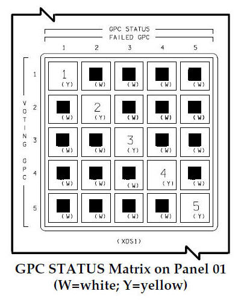

# Cluster, Load Balancing, Failover & Scalability

## 1. Introduction

L'architecure en système distribué a donc certains avantages

- La capacité à répartir la charge de travail (load balancing)
- Une bonne tolérance aux pannes par la reprise de charge (failover)
- Flexibilité pour augmenter progressivement les ressources (scalability)

Ces trois points sont matérialisées au sein d'un cluster

## 2. Le Cluster

> Un **cluster** est un ensemble coordonné de nœuds qui coopèrent pour fournir un service commun.

Exemple: un cluster de centrales de distribution d'énergie signifie :

- Plusieurs centrales répondent à des demandes d'énergie
- Les maisons ne "voient" qu'un ensemble logique (service), pas un serveur
  unique
- La charge peut être répartie
- La panne d'un nœud ne bloque pas le servide (et donc le système)

Un bon cluster réalise de manière transparente pour ses utilisateurs:

- La répartition de la charge de travail entre ses noeuds, diminuant ainsi le temps de traitement apparent
- La redirection d'un job non terminé vers un nouveau noeud, rendant ainsi la panne invisible à l'utilisateur
- L'ajout d'un nouveau noeud

## 3. Répartition de charge, aka "Load Balancing"

> Le **load balancing** consiste à diriger une requête entrante vers un noeud fonctionnel et disponible (ou peu chargé).

Il y a deux modes de fonctionnement possible pour gérer la répartition:

1. La gestion **Centralisée**: les requêtes passent par un noeud appelé Master, qui assigne explicitement la tâche à un des membres du cluster appelé Worker.  
   Les algorithmes les plus courants dans ce mode sont: - **Round Robin** : chacun son tour - **Least Connections** : la tâche va au noeud qui a le moins de travail - **Random** : distribution aléatoire

2. La gestion **Distribuée**: les tâches sont présentées à tous les noeuds, chacun "pioche" dans la liste  
   Chaque noeud choisit une tâche en fonction d'un calcul effectué sur les attributs de la tâche. Le calcul est définit de telle sorte qu'on assure qu'aucune tâche ne restera sur le carreau (**Hash-based**)

## 4. Failover

> Le **failover** est le mécanisme qui permet au cluster de continuer à fonctionner lorsqu'un de ses nœuds tombe.

- Si on a une gestion centralisée, le Master ajuste sa liste de Workers
- Si on a une gestion distribuée, chaque noeud restant doit se reconfigurer pour prendre en charge le travail destiné au noeud tombé

Dans les deux cas, la difficulté réside dans la détection de la panne: comment faire pour savoir qu'un noeud est "mort" ?  
Il existe plusieurs stratégies:

- **Heartbeat** : chaque émet un signal à intervalle régulier. L'absence de ce signal signifie la mort.
- **Timeout** : Une question est envoyée, la mort est déclarée si la réponse n'arrive pas dans un temps défini
- **Détection distribuée** : Chaque noeud évalue l'état des autres et vote pour ou contre l'utilisation de chacun. Exemple célèbre: les ordinateurs de bord de la navette spatiale:  
  

## 5. Scalability

L'augmentation de capacité est en fait tout simplement l'exact inverse de la panne (problème de détection en moins).

Pour augmenter la capacité d'un cluster, on crée le nouveau noeud, puis:

- Si on a une gestion centraliseé, on ajuste la liste de Workers du Master
- Si on a une gestion distribuée, on configure la (nouvelle) règle de répartition sur le nouveau noeud et on reconfigure les autres noeuds avec cette même règle
